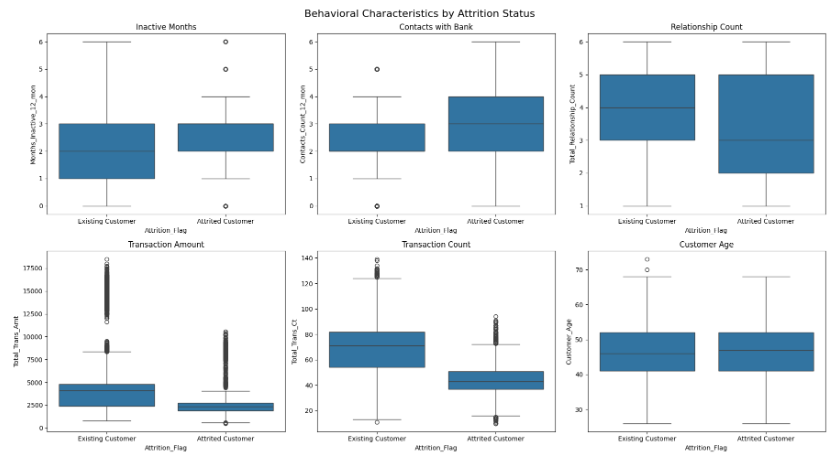
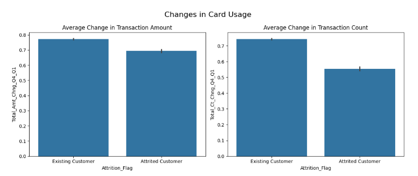
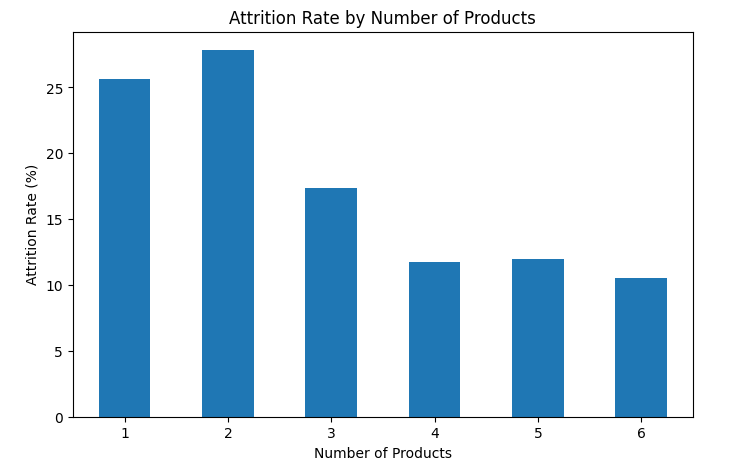

# credit-card-customer

A data analysis project aimed at identifying the factors associated with credit card customer churn through exploratory data analysis (EDA) techniques and business recommendations designed to improve customer retention.

## Project Description

This project analyzes the factors associated with credit card customer churn through exploratory data analysis. By examining demographic, financial, and behavioral variables, it identifies patterns that help recognize customers at the highest risk of churning and proposes strategies to strengthen customer retention.

The project was developed following the data analysis process proposed in the Google Data Analytics Professional Certificate, which consists of the following phases:

- Ask
- Prepare
- Process
- Analyze
- Share
- Act

## Business Problem

Customer churn is one of the main challenges faced by financial institutions, as retaining an existing customer is generally less costly than acquiring a new one. Therefore, this project aims to identify the variables most strongly associated with customer churn and provide business recommendations to help reduce the credit card cancellation rate.

## Objectives

**General Objective:** Analyze the behavior of credit card customers to identify the factors associated with customer churn and generate business recommendations aimed at improving customer retention.

## Specific Objectives

- Analyze the demographic and financial characteristics of customers.
- Identify differences between active customers and customers who churned.
- Classify customers according to their credit card usage and financial behavior.
- Propose business recommendations to reduce the customer churn rate.

## Business Questions

- What are the characteristics of customers who churn from the credit card service?
- Which variables are most strongly associated with customer churn?
- Which customer segments are at the highest risk of churn?
- What strategies can be implemented to improve customer retention?

## Dataset

- **Source:** Kaggle
- **Dataset Name:** Credit Card Customers
- **Number of Records:** 10,127 customers
- **Number of Variables:** 23

## Dataset Link:

https://www.kaggle.com/code/kevinsotelog/credit-card-customer-attrition-analysis

## Tools Used

- Python
- Pandas
- NumPy
- Matplotlib
- Seaborn
- Kaggle Notebook

## Key Findings

The analysis revealed the following key findings:

- Customers who make fewer transactions are more likely to churn.
- Customers with lower purchase amounts also exhibit higher churn rates.
- Customers who hold only one or two financial products are at a significantly higher risk of leaving the bank.
- Low credit utilization is associated with a higher probability of customer churn.
- Behavioral variables are more strongly associated with customer churn than demographic variables.

## Business Recommendations

Based on the findings, the following actions are recommended:

- Implement an early warning system to identify customers whose credit card usage has significantly declined.
- Develop marketing campaigns to encourage credit card usage through promotions and rewards programs.
- Strengthen customer relationships by implementing cross-selling strategies for additional financial products.

## Project Preview

### Behavioral Variables

Customers who churned exhibit fewer transactions, lower spending, and higher levels of inactivity, suggesting that customer behavior is a key indicator of churn risk.

Churn Rate by Credit Card Usage Level

Customers with low credit card usage exhibit the highest churn rates, whereas those who use their credit cards more frequently are more likely to remain with the bank.

Churn Rate by Number of Financial Products

Customers who hold a larger number of financial products exhibit lower churn rates, highlighting the importance of strengthening the customer–bank relationship.

## Skills Demonstrated

- Data cleaning and transformation using Python.
- Exploratory Data Analysis (EDA).
- Data visualization with Matplotlib and Seaborn.
- Customer segmentation.
- Pattern and trend identification.
- Development of data-driven business recommendations.

## How to Run the Project

1. Download the notebook from this repository.
2. Download the dataset from Kaggle.
3. Upload both files to a new Kaggle Notebook or run them locally using Jupyter Notebook.

